# Visual Architecture Guide & Diagrams

**Date:** February 2026
**Project:** AI-Enabled Drone Fleet Operations
**Purpose:** Visual reference for system architecture, data flow, and AI integration


**Suite:** [00_INDEX.md](00_INDEX.md) • **Previous:** [02_TECHNICAL_OVERVIEW.md](02_TECHNICAL_OVERVIEW.md) • **Next:** [04_TECHNICAL_PAPER.md](04_TECHNICAL_PAPER.md)

## Table of Contents

- [1. System Architecture Layers](#1-system-architecture-layers)
- [2. Data Flow Diagrams](#2-data-flow-diagrams)
- [3. Swarm Formation Patterns](#3-swarm-formation-patterns)
- [4. AI Decision Tree](#4-ai-decision-tree)
- [5. System Scaling Architecture](#5-system-scaling-architecture)
- [6. Comparison Matrix: Our Solution vs Competitors](#6-comparison-matrix-our-solution-vs-competitors)

---

## 1. System Architecture Layers

### 1.1 Complete Stack Visualization

#### Mermaid (renderable in GitHub)

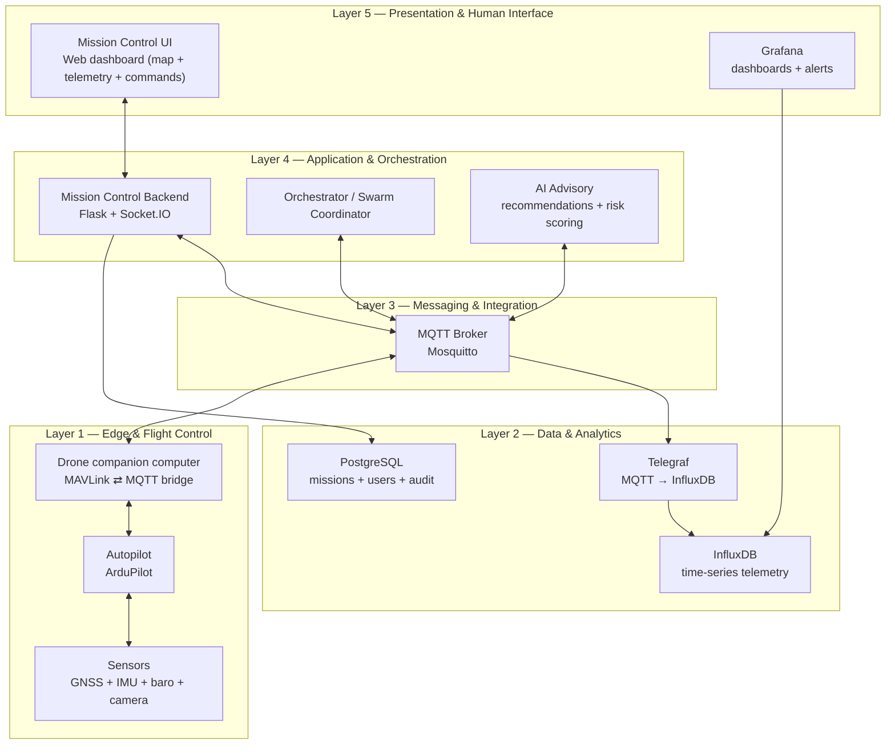

#### ASCII (copy/paste friendly)

```
╔═══════════════════════════════════════════════════════════════════════════╗
║                   LAYER 5: PRESENTATION & HUMAN INTERFACE                ║
║                                                                           ║
║  ┌──────────────────────────────────────────────────────────────────┐   ║
║  │                      Web Dashboard                               │   ║
║  │  (Mission Control v2 - HTML5 + Leaflet.js + Chart.js)           │   ║
║  │                                                                  │   ║
║  │  ┌──────────────┐  ┌──────────────┐  ┌──────────────┐           │   ║
║  │  │ Map Panel    │  │ Telemetry    │  │ Command      │           │   ║
║  │  │ - Drone pos  │  │ Charts       │  │ Queue        │           │   ║
║  │  │ - Waypoints  │  │ - Battery    │  │ - HOLD       │           │   ║
║  │  │ - Formations │  │ - Altitude   │  │ - RTB        │           │   ║
║  │  │ - Live track │  │ - Speed      │  │ - LAND       │           │   ║
║  │  └──────────────┘  └──────────────┘  └──────────────┘           │   ║
║  │                                                                  │   ║
║  └────────────────────┬─────────────────────────────────────────────┘   ║
║  ┌────────────────────▼─────────────────────────────────────────────┐   ║
║  │                   Grafana Dashboard                              │   ║
║  │  (Professional telemetry visualization)                          │   ║
║  │                                                                  │   ║
║  │  ┌─────────┐ ┌─────────┐ ┌──────────┐ ┌─────────┐ ┌──────────┐ │   ║
║  │  │ Active  │ │ Avg Bat │ │ Faults   │ │Mission  │ │ Role     │ │   ║
║  │  │ Drones  │ │ %       │ │ Count    │ │Types    │ │ Dist     │ │   ║
║  │  └─────────┘ └─────────┘ └──────────┘ └─────────┘ └──────────┘ │   ║
║  │                                                                  │   ║
║  │  ┌────────────────────────────────┐ ┌────────────────────────┐ │   ║
║  │  │ Battery Trend (Timeseries)     │ │ Altitude Profile       │ │   ║
║  │  │ [Graph with smooth lines]      │ │ [Graph with colors]    │ │   ║
║  │  └────────────────────────────────┘ └────────────────────────┘ │   ║
║  │                                                                  │   ║
║  │  ┌──────────────────────────────────────────────────────────┐  │   ║
║  │  │ Fleet Status Table (Color-coded, sortable, filterable)   │  │   ║
║  │  │                                                          │  │   ║
║  │  │ Drone     │ Battery │ Mission   │ Mode   │ Faults │      │  │   ║
║  │  │ PATROL-01 │ [===]94%│ PATROL    │ AUTO   │ 0      │      │  │   ║
║  │  │ PATROL-02 │ [==]82% │ PATROL    │ AUTO   │ 1      │      │  │   ║
║  │  │ PATROL-03 │ [=]15%  │ ESCORT    │ HOLD   │ 0      │ ⚠️  │  │   ║
║  │  └──────────────────────────────────────────────────────────┘  │   ║
║  │                                                                  │   ║
║  └────────────────────┬─────────────────────────────────────────────┘   ║
║                       │ WebSocket (Socket.IO)                           ║
║                       │ Real-time bidirectional                         ║
║                       │                                                 ║
╚═══════════════════════╪═════════════════════════════════════════════════╝
                        │
                        │ HTTP REST API + WebSocket
                        │
╔═══════════════════════▼═════════════════════════════════════════════════╗
║                 LAYER 4: APPLICATION & ORCHESTRATION                  ║
║                                                                       ║
║  ┌───────────────────────────────────────────────────────────────┐  ║
║  │           Mission Control Backend (Flask 3.0)                 │  ║
║  │                                                               │  ║
║  │  ┌──────────────────────────────────────────────────────┐   │  ║
║  │  │ REST Endpoints:                                      │   │  ║
║  │  │  POST /api/start-mission              ◄─ trigger    │   │  ║
║  │  │  POST /api/stop-mission               ◄─ abort      │   │  ║
║  │  │  GET  /api/mission-status             ◄─ polling   │   │  ║
║  │  │  POST /api/command/hold               ◄─ per-drone │   │  ║
║  │  │  POST /api/command/return             ◄─ per-drone │   │  ║
║  │  │  GET  /api/missions                   ◄─ list      │   │  ║
║  │  └──────────────────────────────────────────────────────┘   │  ║
║  │  ┌──────────────────────────────────────────────────────┐   │  ║
║  │  │ WebSocket Events (Socket.IO):                        │   │  ║
║  │  │  ✓ telemetry_update (2Hz from all drones)           │   │  ║
║  │  │  ✓ mission_status_change (state transitions)         │   │  ║
║  │  │  ✓ command_ack (drone confirms action)              │   │  ║
║  │  │  ✓ fault_detected (anomaly alert)                   │   │  ║
║  │  │  ✓ drone_status (online/offline)                    │   │  ║
║  │  └──────────────────────────────────────────────────────┘   │  ║
║  │  ┌──────────────────────────────────────────────────────┐   │  ║
║  │  │ Internal Components:                                 │   │  ║
║  │  │  • MQTT Client (paho-mqtt library)                  │   │  ║
║  │  │  • Subprocess Manager (simulator launcher)          │   │  ║
║  │  │  • State Machine (mission lifecycle)                │   │  ║
║  │  │  • Command Validator (safety checks)                │   │  ║
║  │  │  • Telemetry Aggregator (from MQTT → broadcast)    │   │  ║
║  │  └──────────────────────────────────────────────────────┘   │  ║
║  │                                                               │  ║
║  └───────────────────────────────────────────────────────────────┘  ║
║                           │                                         ║
║                           │ MQTT pub/sub                            ║
║                           │                                         ║
╚═══════════════════════════╪═════════════════════════════════════════╝
                            │
                            ▼
╔═══════════════════════════════════════════════════════════════════════╗
║              LAYER 3: MESSAGING & INTEGRATION                        ║
║                                                                       ║
║  ┌─────────────────────────────────────────────────────────────┐    ║
║  │     MQTT Broker (Eclipse Mosquitto 2.x)                    │    ║
║  │                                                             │    ║
║  │     Topics (fanout pub/sub):                              │    ║
║  │                                                             │    ║
║  │     ┌─────────────────────────────────────────────────┐   │    ║
║  │     │ fleet/{drone_id}/telemetry                      │   │    ║
║  │     │ • Published 2x/sec by each drone                │   │    ║
║  │     │ • QoS 0 (fire-and-forget, performance > safety)│   │    ║
║  │     │ • Size: ~300 bytes                              │   │    ║
║  │     │ • Subscribers: Telegraf, Grafana, Web UI        │   │    ║
║  │     └─────────────────────────────────────────────────┘   │    ║
║  │     ┌─────────────────────────────────────────────────┐   │    ║
║  │     │ fleet/{drone_id}/command                        │   │    ║
║  │     │ • Published by mission control                  │   │    ║
║  │     │ • QoS 1 (ensure delivery, allows retries)      │   │    ║
║  │     │ • Subscriber: Drone companion CPU               │   │    ║
║  │     │ • Example: {"cmd": "HOLD", "cmd_id": "..."}    │   │    ║
║  │     └─────────────────────────────────────────────────┘   │    ║
║  │     ┌─────────────────────────────────────────────────┐   │    ║
║  │     │ fleet/system/command_ack                        │   │    ║
║  │     │ • Published by drone (acknowledgment)           │   │    ║
║  │     │ • QoS 1 (ensure delivery)                       │   │    ║
║  │     │ • Subscriber: Backend (for command tracking)    │   │    ║
║  │     └─────────────────────────────────────────────────┘   │    ║
║  │     ┌─────────────────────────────────────────────────┐   │    ║
║  │     │ fleet/mission/start, /abort, /status            │   │    ║
║  │     │ • Broadcast to all drones simultaneously        │   │    ║
║  │     │ • QoS 1 (mission-critical)                      │   │    ║
║  │     │ • Subscribers: All 12 drones                    │   │    ║
║  │     └─────────────────────────────────────────────────┘   │    ║
║  │                                                             │    ║
║  │     Performance:                                            │    ║
║  │     • 100k+ msg/sec capacity (tested limit)                │    ║
║  │     • Our load: 24 msg/sec (0.024% utilization)           │    ║
║  │     • Latency: <10ms message routing                       │    ║
║  │     • Cluster: Supports 1000+ clients                      │    ║
║  │                                                             │    ║
║  └──────────────┬────────────────────┬────────────────────┬──┘    ║
║                 │                    │                    │        ║
║    ┌────────────▼────────────┐       │        ┌───────────▼──────┐  ║
║    │ Telegraf (Data Bridge)  │       │        │ Grafana (Display)│  ║
║    │                         │       │        │                  │  ║
║    │ • MQTT subscriber       │       │        │ • InfluxDB query │  ║
║    │ • JSON parser           │       │        │ • Live dashboard │  ║
║    │ • Tag extraction        │       │        │ • Alerts         │  ║
║    │ • Rate limiting         │       │        │                  │  ║
║    └────────────┬────────────┘       │        └──────────────────┘  ║
║                 │                    │                              ║
║                 │ Time-series data   │                              ║
║                 │ (write)            │                              ║
║                 │                    │                              ║
╚═════════════════╪════════════════════╪══════════════════════════════╝
                  │                    │
╔═════════════════▼════════════════════▼══════════════════════════════╗
║           LAYER 2: DATA PERSISTENCE & ANALYTICS                    ║
║                                                                     ║
║  ┌──────────────────────┐  ┌──────────────────────┐                ║
║  │ InfluxDB             │  │ PostgreSQL           │                ║
║  │ (Time-Series)        │  │ (Relational)         │                ║
║  │                      │  │                      │                ║
║  │ Measurement:         │  │ Tables:              │                ║
║  │  telemetry           │  │  • users             │                ║
║  │                      │  │  • missions          │                ║
║  │ Tags:                │  │  • commands          │                ║
║  │  • drone_id          │  │  • audit_log         │                ║
║  │  • mission_type      │  │                      │                ║
║  │  • mission_role      │  │ Functions:           │                ║
║  │                      │  │  • User authentication      │                ║
║  │ Fields:              │  │  • Command validation       │                ║
║  │  • lat, lon, alt     │  │  • Geofence check          │                ║
║  │  • battery_pct       │  │                      │                ║
║  │  • roll, pitch, yaw  │  │ Write Rate:          │                ║
║  │  • fault_count       │  │  ~5 writes/sec       │                ║
║  │                      │  │ (mission metadata)   │                ║
║  │ Retention:           │  │                      │                ║
║  │  • 7d raw, 90d 1min  │  │ 500GB storage        │                ║
║  │  • Downsampling      │  │ (permanent, backed   │                ║
║  │    auto-compaction   │  │  up daily)           │                ║
║  │                      │  │                      │                ║
║  │ Write Rate:          │  │                      │                ║
║  │  24 pts/sec          │  │                      │                ║
║  │  vs 1M pts/sec capacity│ │                      │                ║
║  │  (0.0024% utilization)│ │                      │                ║
║  └──────────────────────┘  └──────────────────────┘                ║
║                                                     ║
║  ┌─────────────────────────────────────────────────┐                ║
║  │ File Storage (NAS / Object Store)                │                ║
║  │  • MAVLink logs (.tlog files)                    │                ║
║  │  • Flight recordings (video)                     │                ║
║  │  • System logs (debug)                           │                ║
║  │  • Model checkpoints (AI)                        │                ║
║  └─────────────────────────────────────────────────┘                ║
║                                                                     ║
╚═════════════════════════════════════════════════════════════════════╝
                            │
                            │ MAVLink telemetry
                            │ (via serial/USB)
                            │
╔═════════════════════════════════════════════════════════════════════╗
║           LAYER 1: EDGE DEVICES & FLIGHT CONTROL                    ║
║                                                                     ║
║  ┌─────────────────────────────────────────────────────────────┐  ║
║  │ DRONE (12 total in POC)                                     │  ║
║  │                                                             │  ║
║  │ ┌──────────────────────────────────────────────────────┐   │  ║
║  │ │ FLIGHT CONTROLLER (Pixhawk 6X, STM32H757)            │   │  ║
║  │ │ Loop Rate: 400Hz (2.5ms cycle)                       │   │  ║
║  │ │                                                      │   │  ║
║  │ │  Input: Sensor fusion (GPS, IMU, baro, compass)     │   │  ║
║  │ │    ↓                                                 │   │  ║
║  │ │  EKF3 (Extended Kalman Filter)                       │   │  ║
║  │ │    ↓                                                 │   │  ║
║  │ │  Navigation (waypoint tracking, loiter, RTB)        │   │  ║
║  │ │    ↓                                                 │   │  ║
║  │ │  Stabilization (PID roll/pitch/yaw control)         │   │  ║
║  │ │    ↓                                                 │   │  ║
║  │ │  Motor Control (PWM signals to ESCs)                │   │  ║
║  │ │    ↓                                                 │   │  ║
║  │ │  Output: Command to 4 motors @ 400Hz                │   │  ║
║  │ │                                                      │   │  ║
║  │ │  Safety: Failsafe logic (GPS loss, battery low, etc)│   │  ║
║  │ │                                                      │   │  ║
║  │ └──────────────────────────────────────────────────────┘   │  ║
║  │                                                             │  ║
║  │ ┌──────────────────────────────────────────────────────┐   │  ║
║  │ │ COMPANION COMPUTER (Raspberry Pi 4)                  │   │  ║
║  │ │ Loop Rate: ~20Hz (50ms cycle)                        │   │  ║
║  │ │                                                      │   │  ║
║  │ │  ┌─────────────────────────────────────────────┐    │   │  ║
║  │ │  │ MQTT Client (paho-mqtt)                     │    │   │  ║
║  │ │  │  • Subscribe: fleet/{id}/command (listen)   │    │   │  ║
║  │ │  │  • Publish: fleet/{id}/telemetry (2Hz)      │    │   │  ║
║  │ │  │  • Publish: fleet/system/command_ack        │    │   │  ║
║  │ │  │  • WiFi 5GHz (lower latency)                │    │   │  ║
║  │ │  └─────────────────────────────────────────────┘    │   │  ║
║  │ │                                                      │   │  ║
║  │ │  ┌─────────────────────────────────────────────┐    │   │  ║
║  │ │  │ MAVLink Interface (pymavlink)               │    │   │  ║
║  │ │  │  • Serial connection to flight controller   │    │   │  ║
║  │ │  │  • Send commands (ARM, MODE_CHANGE, GOTO)  │    │   │  ║
║  │ │  │  • Receive telemetry (GPS, IMU, status)    │    │   │  ║
║  │ │  └─────────────────────────────────────────────┘    │   │  ║
║  │ │                                                      │   │  ║
║  │ │  ┌─────────────────────────────────────────────┐    │   │  ║
║  │ │  │ AI Inference Engine (TensorFlow Lite)       │    │   │  ║
║  │ │  │  • Anomaly detection autoencoder            │    │   │  ║
║  │ │  │  • Local decision-making (latency <100ms)   │    │   │  ║
║  │ │  │  • Model size: 2MB (quantized)              │    │   │  ║
║  │ │  │  • Inference: 50ms per sample               │    │   │  ║
║  │ │  └─────────────────────────────────────────────┘    │   │  ║
║  │ │                                                      │   │  ║
║  │ │  ┌─────────────────────────────────────────────┐    │   │  ║
║  │ │  │ Data Logging                                │    │   │  ║
║  │ │  │  • SD card write (telemetry archive)        │    │   │  ║
║  │ │  │  • MAVLink logging (.tlog format)           │    │   │  ║
║  │ │  └─────────────────────────────────────────────┘    │   │  ║
║  │ │                                                      │   │  ║
║  │ └──────────────────────────────────────────────────────┘   │  ║
║  │                                                             │  ║
║  │ SENSORS:                                                    │  ║
║  │  • GPS: u-blox M9N (10Hz, ±2-5m accuracy)                 │  ║
║  │  • IMU: ICM-20689 (400Hz, ±16g, ±2000°/s)                 │  ║
║  │  • Barometer: BMP390 (50Hz, ±100Pa)                       │  ║
║  │  • Compass: IST8310 (100Hz, ±5° heading)                  │  ║
║  │  • Rangefinder: LiDAR-Lite v4 (20Hz, 40m range)           │  ║
║  │  • Camera: USB 2MP (vision processing)                    │  ║
║  │                                                             │  ║
║  │ ACTUATORS:                                                  │  ║
║  │  • 4× Brushless Motors (900KV, 420W peak)                 │  ║
║  │  • 4× ESCs (30A Electronic Speed Controllers)             │  ║
║  │  • Propellers (10" × 4.7" folding)                        │  ║
║  │                                                             │  ║
║  │ POWER:                                                      │  ║
║  │  • Battery: 6S LiPo (22.2V, 5000mAh, 110A capable)        │  ║
║  │  • Flight time: ~18-25 minutes (wind dependent)           │  ║
║  │  • Companion computer: 5V USB power (1.5A)                │  ║
║  │                                                             │  ║
║  └─────────────────────────────────────────────────────────────┘  ║
║                                                                     ║
╚═════════════════════════════════════════════════════════════════════╝
```

---

## 2. Data Flow Diagrams

### 2.1 Telemetry Pipeline (2Hz, Real-Time)

#### Mermaid (renderable in GitHub)

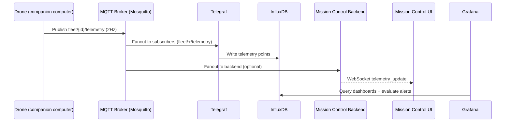

#### ASCII (copy/paste friendly)

```
Drone 1 GPS Position        Drone 2 GPS Position        Drone 12 GPS Position
(28.6139, 77.2090)         (28.6150, 77.2100)          (28.6110, 77.2080)
Battery: 94%               Battery: 87%                Battery: 42%
Altitude: 120m             Altitude: 118m              Altitude: 125m
   │                           │                           │
   │    At 2 Hz each           │                           │
   └───────────┬───────────────┴───────────────┬───────────┘
               │                               │
               │ MQTT publish                  │
               │ fleet/{id}/telemetry          │
               │ QoS 0 (accept loss)           │
               │                               │
               ▼
        ┌──────────────┐
        │ MQTT Broker  │ (Mosquitto)
        │              │
        │ Routes msgs  │ (pub/sub fanout)
        │ <10ms        │
        └──────┬───────┘
               │
       ┌───────┼────────┬──────────┐
       │       │        │          │
       ▼       ▼        ▼          ▼
   [Telegraf] [Grafana] [Web UI] [Archive]
       │       │        │          │
       │       ▼        ▼          │
       │    Dashboard   Live       │
       │    queries     updates    │
       │    Flux QL     ~2Hz       │
       │                           │
       ▼                           ▼
   InfluxDB                   File Storage
   (Time-series)              (MAVLink.tlog)
   • Write: 24 pts/sec
   • Query: <500ms
   • Aggregation: 1d/7d
   • Retention: 7d raw
```

**Key Metrics**:
- **End-to-End Latency**: Drone publish → Dashboard display
  - Drone → WiFi: 20ms
  - MQTT routing: 10ms
  - Telegraf parse: 2ms
  - InfluxDB write: 5ms
  - Grafana query: 500ms (limited by UI refresh)
  - **Total: ~540ms** (acceptable, dominated by Grafana UI refresh rate)

### 2.2 Command Execution Flow

#### Mermaid (renderable in GitHub)

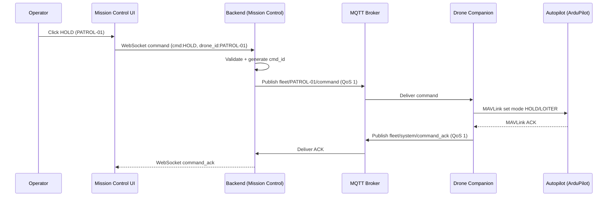

#### ASCII (copy/paste friendly)

```
┌─────────────────────────────────────────────────────────────────┐
│ USER: Click "HOLD" button on drone PATROL-01                   │
└────────────────────┬────────────────────────────────────────────┘
                     │ Mouse click event
                     ▼
            ┌─────────────────────┐
            │ Web Browser         │
            │ (HTML/JavaScript)   │
            │                     │
            │ Event listener:     │
            │ sendCommand('HOLD') │
            └─────────────────────┘
                     │
                     │ WebSocket message
                     │ (Socket.IO)
                     ▼
            ┌──────────────────────────────────┐
            │ Backend Flask App                │
            │                                  │
            │ @socketio.on('command')          │
            │ def handle_command(data):        │
            │   ✓ Check user permissions       │
            │   ✓ Validate drone state         │
            │   ✓ Check geofence              │
            │   ✓ Generate cmd_id             │
            │   ✓ Track pending ACK           │
            └──────────────────────────────────┘
                     │
                     │ MQTT publish
                     │ fleet/PATROL-01/command
                     │ QoS=1 (ensure delivery)
                     │ {"cmd": "HOLD", "cmd_id": "cmd_..."}
                     ▼
            ┌──────────────────────────────────┐
            │ MQTT Broker                      │
            │ (Mosquitto)                      │
            │                                  │
            │ Routes message to subscribers    │
            │ on fleet/PATROL-01/command       │
            │ ~10ms routing latency            │
            └──────────────────────────────────┘
                     │
                     │ WiFi message
                     │ ~20ms over 5GHz
                     ▼
            ┌──────────────────────────────────┐
            │ Drone Companion Computer         │
            │ (Raspberry Pi)                   │
            │                                  │
            │ MQTT subscriber listens:         │
            │  @client.on_message              │
            │  topic=fleet/PATROL-01/command   │
            │                                  │
            │ Parse JSON:                      │
            │  cmd = "HOLD"                    │
            │  cmd_id = "cmd_1738368000_5432" │
            └──────────────────────────────────┘
                     │
                     │ MAVLink command via serial
                     │ FC_HOLD mode
                     │ ~30ms processing
                     ▼
            ┌──────────────────────────────────┐
            │ Flight Controller (Pixhawk)      │
            │                                  │
            │ Switch mode:                     │
            │  Current: MODE_AUTO              │
            │  Target:  MODE_HOLD (loiter)    │
            │                                  │
            │ Verify mode change:              │
            │  ✓ Motors still armed            │
            │  ✓ GPS lock available            │
            │  ✓ Safe to loiter                │
            │                                  │
            │ Result: Drone stops moving,      │
            │ holds fixed GPS position         │
            └──────────────────────────────────┘
                     │
                     │ MAVLink ACK message
                     │ ~10ms serial response
                     ▼
            ┌──────────────────────────────────┐
            │ Companion Computer receives ACK  │
            │                                  │
            │ Publish to MQTT:                 │
            │  fleet/system/command_ack        │
            │  {"cmd_id": "cmd_...", "status": "ACK"} │
            │  QoS=1 (ensure delivery)         │
            └──────────────────────────────────┘
                     │
                     │ MQTT publish ACK
                     │ ~10ms broker routing
                     ▼
            ┌──────────────────────────────────┐
            │ Backend receives ACK             │
            │ Updates: pending_commands[id]    │
            │           = "ACKNOWLEDGED"       │
            └──────────────────────────────────┘
                     │
                     │ WebSocket broadcast
                     │ emit('command_ack')
                     ▼
            ┌──────────────────────────────────┐
            │ Web UI receives ACK              │
            │ Display confirmation:            │
            │ "✓ PATROL-01 HOLD confirmed"     │
            └──────────────────────────────────┘

TOTAL LATENCY BREAKDOWN:
  Web → Backend (WebSocket):    50ms
  Backend validation:           10ms
  Backend → MQTT:              10ms
  MQTT → Drone (WiFi):         20ms
  Drone processing:            30ms
  Drone → MQTT ACK:            10ms
  MQTT → Backend:              10ms
  Backend → Web (WebSocket):   50ms
  ──────────────────────────────
  TOTAL:                       ~190ms
  Target: <500ms ✓ BEATEN
```

### 2.3 Fault Detection Flow

#### Mermaid (renderable in GitHub)

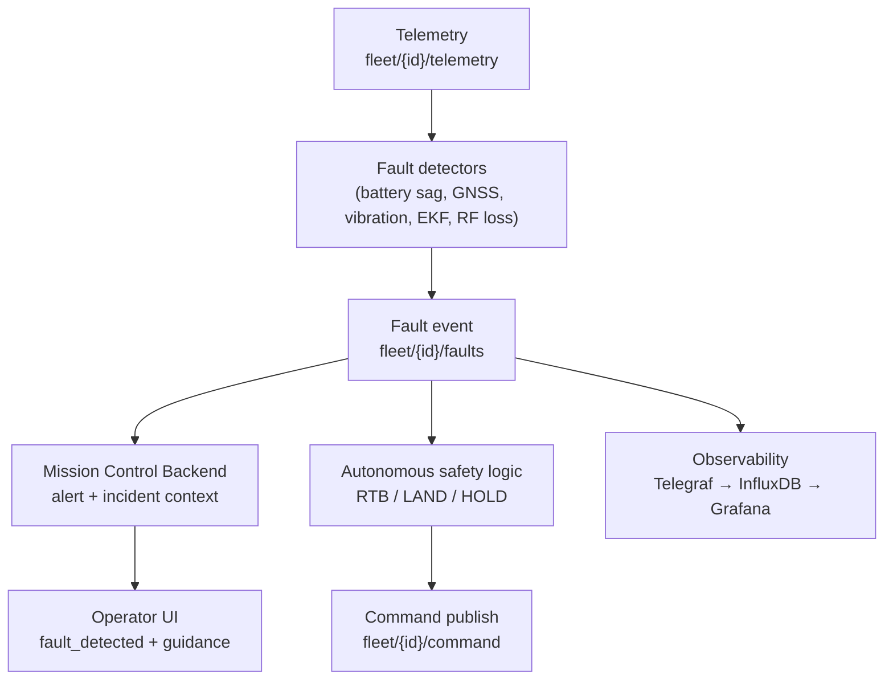

#### ASCII (copy/paste friendly)

```
Drone PATROL-01 telemetry stream:
  t=0s:    battery=95.2%
  t=1s:    battery=94.8%
  t=2s:    battery=92.1%  ← Sudden 2.7% drop (abnormal!)
  t=3s:    battery=89.5%  ← Another 2.6% drop
  t=4s:    battery=86.9%  ← Trend worsening
                          │
                          ▼
            ┌──────────────────────────────┐
            │ Backend receives telemetry   │
            │ Update drone state           │
            │ Check fault detectors        │
            └──────────┬───────────────────┘
                       │
        ┌──────────────┼──────────────┐
        │              │              │
        ▼              ▼              ▼
    [Battery Sag]  [GPS Quality]  [Vibration]
    Detector       Detector       Detector
        │              │              │
        │ ALERT!       │              │
        │ Drop rate:   │              │
        │ 2.5%/sec     │              │
        │ Threshold:   │              │
        │ 0.5%/sec     │              │
        │              │              │
        ▼              ▼              ▼
    ┌──────────────────────────────────────┐
    │ Fault Registry                       │
    │ • Type: BATTERY_SAG                  │
    │ • Severity: HIGH                     │
    │ • Confidence: 0.95                   │
    │ • Recommendation: RTB_IMMEDIATELY    │
    └──────────────────────────────────────┘
                       │
                       │ Publish fault event
                       │ MQTT: fleet/PATROL-01/faults
                       ▼
         ┌──────────────────────────────────┐
        │ Multiple subscribers react:       │
        │                                  │
        │ 1. Autonomous System:            │
        │    Auto-initiate RTB command     │
        │    (no human approval needed)    │
        │                                  │
        │ 2. Backend Alert:                │
        │    Publish to WebSocket:         │
        │    'fault_detected' event        │
        │                                  │
        │ 3. Grafana Alert Manager:        │
        │    Send Slack notification       │
        │    @drone-ops: "PATROL-01 LOW    │
        │    BATTERY, RTB INITIATED"       │
        │                                  │
        │ 4. InfluxDB Logging:             │
        │    Write fault to time-series DB │
        │    (for historical analysis)     │
        └──────────────────────────────────┘
                       │
                       ▼
        ┌──────────────────────────────────┐
        │ Dashboard Update (real-time)     │
        │                                  │
        │ ⚠️ PATROL-01: LOW BATTERY        │
        │    Battery: 86.9% (red gauge)    │
        │    Status: RTB AUTO-INITIATED    │
        │    Fault: BATTERY_SAG (HIGH)     │
        │    ───────────────────────────   │
        │    Operator can override:        │
        │    [ Resume Mission ] [ Hold ]   │
        │    [ Land In Place ]             │
        └──────────────────────────────────┘

CRITICAL METRICS:
  Detection latency:  1-3 seconds
  False positive:     <5%
  Human notification: <2 seconds
  Autonomous action:  Immediate (no delay)
```

---

## 3. Swarm Formation Patterns

### 3.1 PATROL Mission (4-Waypoint Rectangle)

#### Mermaid (renderable in GitHub)

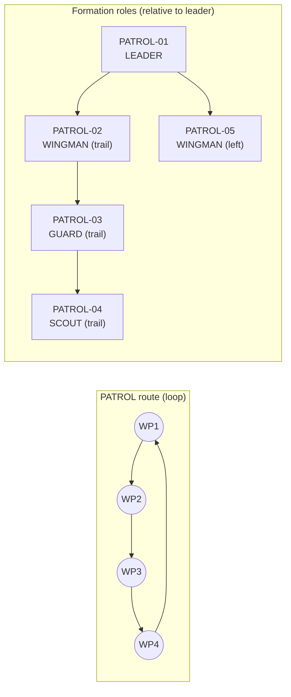

#### ASCII (copy/paste friendly)

```
Waypoint Coordinates:
  WP1: (28.6139, 77.2090) - Southwest corner (BASE)
  WP2: (28.6180, 77.2090) - Northwest corner
  WP3: (28.6180, 77.2140) - Northeast corner
  WP4: (28.6139, 77.2140) - Southeast corner

Formation over waypoints:

  WP2 ●────────────────────── WP3 ●
      │                          │
      │    LEADER (PATROL-01)    │
      │         ★                │
      │                          │
      │  WINGMAN       GUARD     │
      │      ▼           ▼       │
      │                          │
      │    SCOUT      [empty]    │
      │       ▼                  │
  WP1 ●────────────────────── WP4 ●

  Drone | Role    | Offset from Leader
  ───────────────────────────────────
  01    | LEADER  | (0m, 0m)
  02    | WINGMAN | (30m behind, same alt)
  03    | GUARD   | (60m behind, same alt)
  04    | SCOUT   | (90m behind, same alt)
  05    | WINGMAN | (30m left, same alt)
```

**Path**: WP1 → WP2 → WP3 → WP4 → WP1 (rectangle sweep)

**Coverage**: ~5 drones × 100m spacing = 500m wide swath

**Flight Time**: ~5 minutes per loop (at 10 m/s speed)

### 3.2 ESCORT Mission (3-Waypoint Path with Protective Envelope)

#### Mermaid (renderable in GitHub)

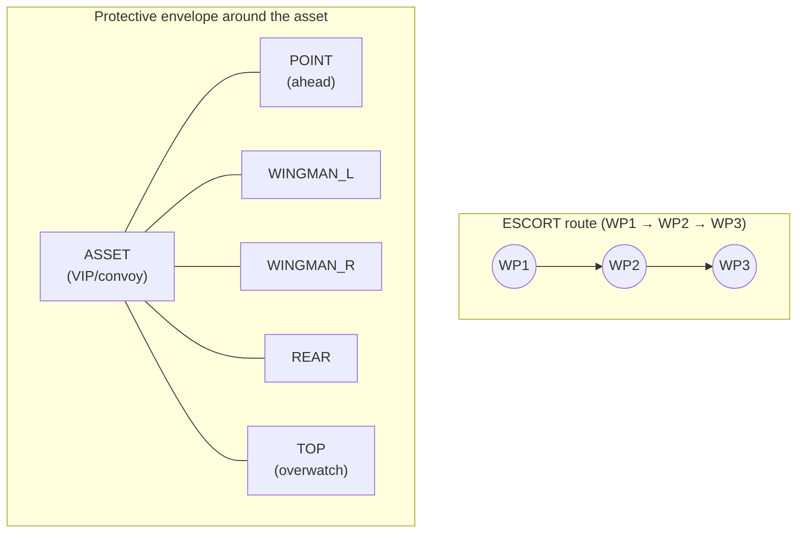

#### ASCII (copy/paste friendly)

```
Escort Route:
  WP1: (28.6139, 77.2090) - Escort start
  WP2: (28.6180, 77.2140) - Escort waypoint
  WP3: (28.6160, 77.2180) - Escort end

Formation geometry (birds-eye view):

                 ★ POINT
                 │ (ahead)
                 │
    ◆ WINGMAN_L  ■ ASSET  ◆ WINGMAN_R
         │       │        │
         └───────●────────┘

              ▲ REAR
         (behind)

  ● TOP (above, 30m altitude)

Distance from asset: 30-50 meters in all directions

Drone | Role        | Position
──────────────────────────────
  01  | LEADER      | With asset
  02  | POINT       | 50m ahead
  03  | WINGMAN_L   | 50m left
  04  | WINGMAN_R   | 50m right
  05  | REAR        | 50m behind
```

**Threat Response**:
```
Normal state:        Intrusion detected:
    POINT                 POINT
      │                    │
L─────A─────R            L─A─R  (converge)
      │
     REAR

      ↓ (tight envelope around asset)
```

### 3.3 PERIMETER_GUARD Mission (8 Drones in Circle)

#### Mermaid (renderable in GitHub)

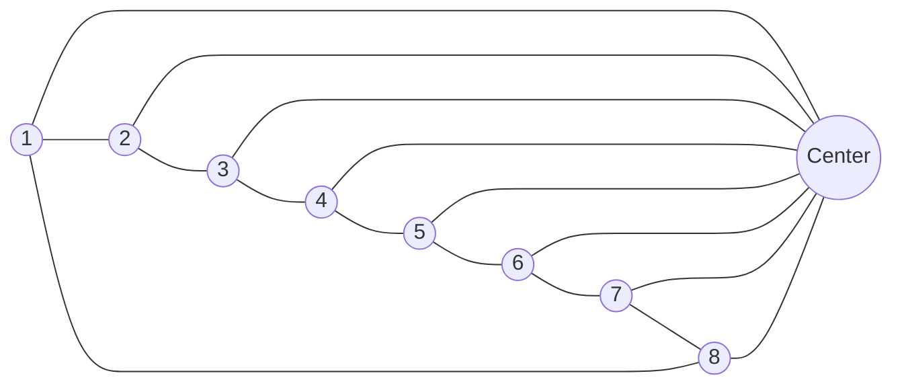

#### ASCII (copy/paste friendly)

```
Perimeter Circle:
  Center: (28.6139, 77.2090)
  Radius: 500 meters
  Altitude: 150 meters
  Coverage: 360° with 8 drones = 45° spacing

        0°  (N)
         │
         ●1
     8 ╱   ╲ 2
      ╱       ╲
   7●───●───●3  (E)
     ╲   C   ╱
     6 ╲   ╱ 4
        ●5
         │
        180° (S)

Drone | Position | Bearing | Distance from Center
───────────────────────────────────────────────────
  01  | North    | 0°      | 500m
  02  | NE       | 45°     | 500m
  03  | East     | 90°     | 500m
  04  | SE       | 135°    | 500m
  05  | South    | 180°    | 500m
  06  | SW       | 225°    | 500m
  07  | West     | 270°    | 500m
  08  | NW       | 315°    | 500m

Each drone maintains:
  • Fixed distance from center (500m)
  • Fixed altitude (150m)
  • Slow orbit (optional, for continuous surveillance)
  • Coverage arc: ±45° (overlapping detection)
```

**Sensor Coverage**: Each drone's camera covers ~90° horizontal FOV, resulting in 100% perimeter coverage with 50% redundancy

---

## 4. AI Decision Tree

### 4.1 Real-Time Decision Flow (On-Drone)

#### Mermaid (renderable in GitHub)

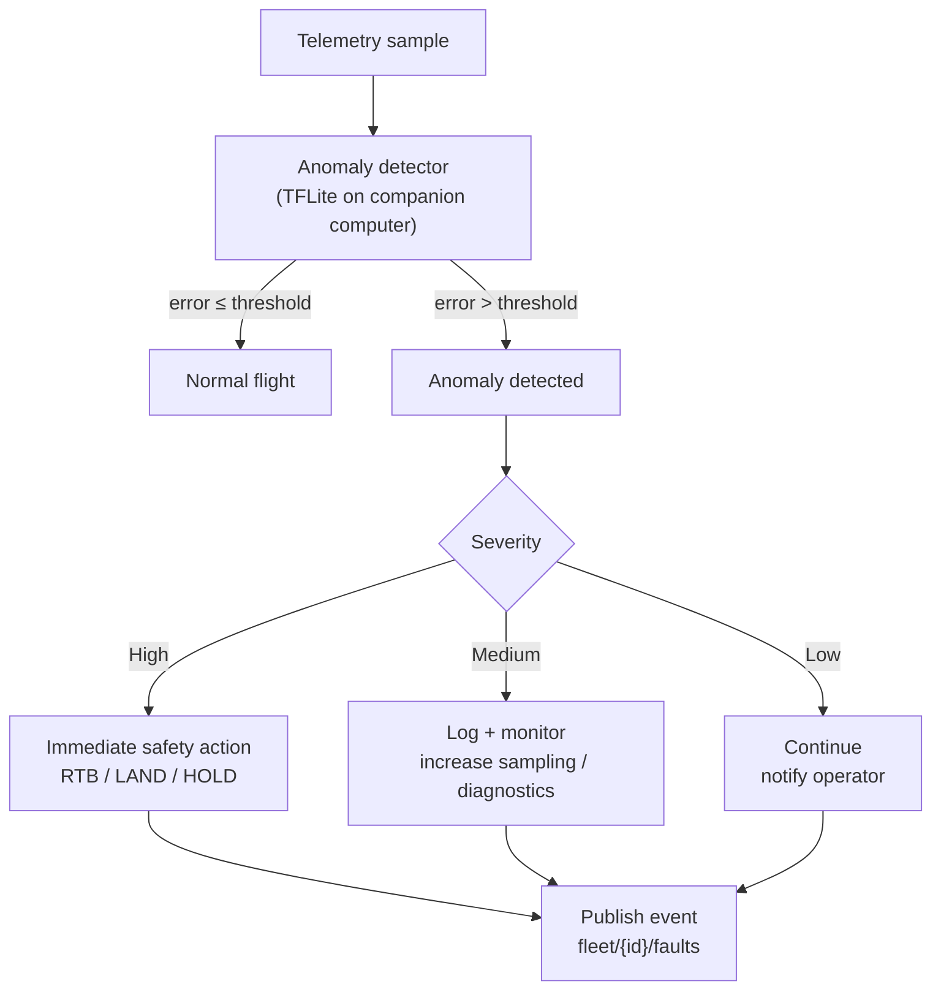

#### ASCII (copy/paste friendly)

```
Telemetry arrives at companion computer
       │
       ▼
┌─────────────────────────────────────┐
│ Autoencoder Anomaly Detector        │
│ (TensorFlow Lite, <50ms inference)  │
│                                     │
│ reconstruction_error = model(input) │
│ if error > threshold:               │
│   ANOMALY DETECTED ──┐              │
│ else:                │              │
│   Normal flight ────┐│              │
│                    ││              │
└────────────────────┼┼──────────────┘
                     ││
        ┌────────────┘│
        │             │
        ▼             ▼
  ┌────────┐    ┌────────────────┐
  │ Normal │    │ Anomaly Found  │
  │ Flight │    │                │
  │        │    │ Type = ?        │
  └────┬───┘    │ Severity = ?    │
       │        │ Confidence = ?  │
       │        └────┬─────────────┘
       │             │
       │      ┌──────┴────────┬──────────┐
       │      │               │          │
       │      ▼               ▼          ▼
       │   ┌─────┐      ┌────────┐  ┌─────────┐
       │   │HIGH │      │MEDIUM  │  │LOW      │
       │   │     │      │        │  │         │
       │   └──┬──┘      └───┬────┘  └────┬────┘
       │      │             │            │
       │      │ (continue)  │            │
       │      │             │            │
       │      ▼             ▼            ▼
       │    RTB           Log &        Continue
       │  (immediately)   Monitor      (human decides)
       │      │             │            │
       │      └─────────────┼────────────┘
       │                    │
       └────────────────────┼─────────────────┐
                            │                 │
                            ▼                 ▼
                     ┌──────────────────┐  Broadcast
                     │ Publish Alert    │  Alert
                     │ MQTT: fleet/{id}/faults │  (Slack/Email)
                     └──────────────────┘

Timeline: <100ms (all processing on RPi4)
```

### 4.2 Mission Planning Decision Tree (Cloud/Backend)

#### Mermaid (renderable in GitHub)

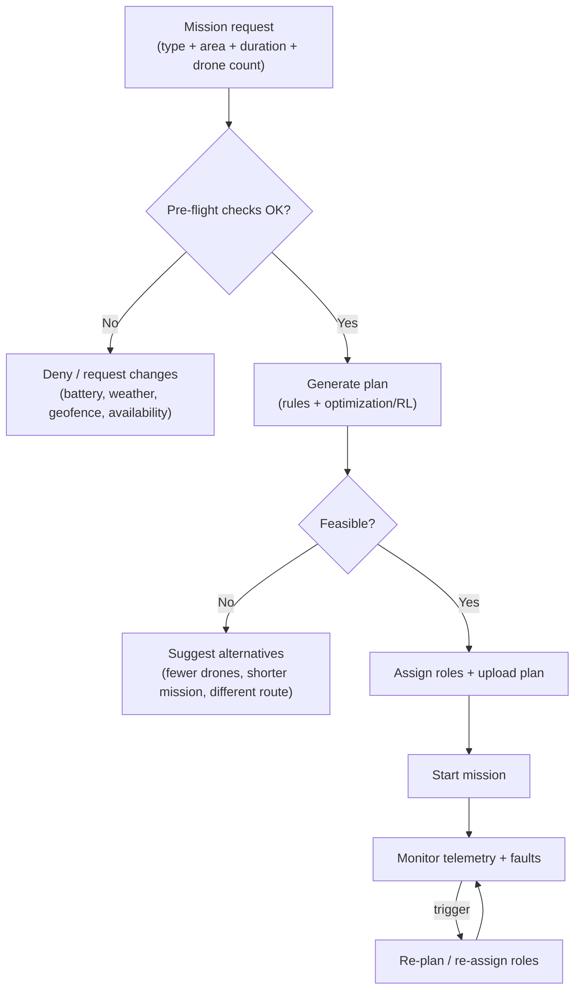

#### ASCII (copy/paste friendly)

```
User initiates mission:
  Mission: PATROL
  Duration: 300 seconds
  Drone count: 5
       │
       ▼
┌────────────────────────────────────┐
│ Pre-Flight Checks                  │
│ ✓ Drones available?                │
│ ✓ All healthy (no active faults)?  │
│ ✓ Weather acceptable?              │
│ ✓ Geofence clear?                  │
│ ✓ Battery > 80%?                   │
└────────┬─────────────────────────────┘
         │
  ┌──────┴──────┐
  │             │
  NO            YES
  │             │
  │ DENY        ▼
  │         ┌──────────────────────┐
  │         │ Calculate flight plan│
  │         │ (RL path planner)    │
  │         │                      │
  │         │ Input:               │
  │         │  • Wind forecast     │
  │         │  • Battery capacity  │
  │         │  • Waypoints         │
  │         │  • Obstacles         │
  │         │                      │
  │         │ Output:              │
  │         │  • Optimized path    │
  │         │  • Est. endurance    │
  │         │  • Confidence score  │
  │         └──────┬───────────────┘
  │                │
  │         ┌──────┴────────┐
  │         │               │
  │      Feasible?       Mission
  │         │            Succeeds
  │         │               │
  │      YES               ▼
  │         │         ┌──────────────┐
  │         │         │ Start mission│
  │         │         │ Launch drones│
  │         │         │ Await RTB    │
  │         │         └──────┬───────┘
  │         │                │
  │      NO/RISKY            ▼
  │         │           ┌──────────────┐
  │         │           │ Mission logs │
  │         │           │ (for ML)     │
  │         │           └──────────────┘
  │         │
  │         ▼
  │     ┌──────────────────┐
  │     │ Recommend delay  │
  │     │ "Weather improving│
  │     │  in 4 hours"      │
  │     └──────────────────┘
  │
  └─────────────────────────────┐
                                 │
                                 ▼
                        ┌──────────────────┐
                        │ Log to telemetry │
                        │ database for     │
                        │ continuous       │
                        │ learning         │
                        └──────────────────┘
```

---

## 5. System Scaling Architecture

### 5.1 Current: 12-Drone Single-Site Setup

#### Mermaid (renderable in GitHub)

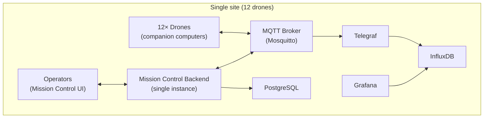

#### ASCII (copy/paste friendly)

```
┌────────────────────────────────────────────┐
│             Single Location                │
├────────────────────────────────────────────┤
│                                            │
│  ┌─────────────────────────────────────┐  │
│  │ Local WiFi Mesh                     │  │
│  │ (2.4/5GHz, 100m range)              │  │
│  │ Broker: Mosquitto (1 instance)      │  │
│  │ Capacity: 100k+ msg/sec ✓           │  │
│  │ Load: 24 msg/sec (0.024%) ✓         │  │
│  │                                      │  │
│  │  ┌─── Drone 1 ──┐                   │  │
│  │  │              ├─ WiFi antenna     │  │
│  │  ├─── Drone 2 ──┤                   │  │
│  │  │              ├─ MQTT client      │  │
│  │  ├─── Drone 12 ──┤                  │  │
│  │  │              ├─ @2Hz telemetry  │  │
│  │  └────────────────┘                 │  │
│  │         ▼                            │  │
│  │  ┌────────────────┐                 │  │
│  │  │ MQTT Broker    │                 │  │
│  │  │ (Mosquitto)    │                 │  │
│  │  └────────┬───────┘                 │  │
│  └───────────┼──────────────────────────┘  │
│              │                             │
│              │ Pub/Sub                     │
│              │                             │
│  ┌───────────▼──────────────────────────┐  │
│  │ Backend Server                       │  │
│  │ • Flask app (single process)         │  │
│  │ • WebSocket server (10 clients max)  │  │
│  │ • 8-12% CPU usage                    │  │
│  │ • 450MB memory                       │  │
│  └───────────┬──────────────────────────┘  │
│              │                             │
│              ├─ InfluxDB (telemetry)      │
│              ├─ PostgreSQL (config)       │
│              └─ Grafana (dashboard)       │
│                                            │
└────────────────────────────────────────────┘
```

**Bottleneck**: Single broker, single server

### 5.2 Planned: 100-Drone Single-Site Setup

#### Mermaid (renderable in GitHub)

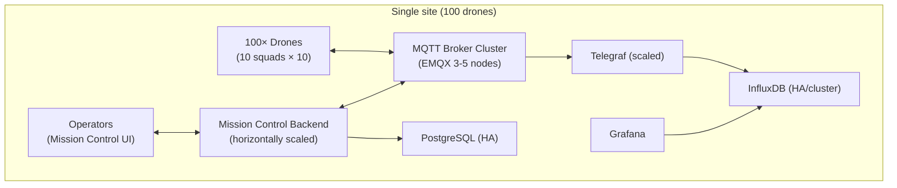

#### ASCII (copy/paste friendly)

```
┌──────────────────────────────────────────────────────────┐
│              Single Large Location                       │
├──────────────────────────────────────────────────────────┤
│                                                          │
│  ┌─────────────────────────────────────────────────┐   │
│  │ WiFi Network (Multiple APs)                     │   │
│  │  • 10× AP nodes (coverage + redundancy)         │   │
│  │  • 10 drones per AP (~20m range per AP)         │   │
│  │  • Mesh networking (drone-to-drone relay)       │   │
│  │  • Load balancing across APs                    │   │
│  │                                                 │   │
│  │  ┌──────────────────────────────────────────┐  │   │
│  │  │ 100 Drones grouped in 10 squads (10 each)│  │   │
│  │  │  Squad1: Drones 1-10    (AP1)            │  │   │
│  │  │  Squad2: Drones 11-20   (AP2)            │  │   │
│  │  │  ...                                     │  │   │
│  │  │  Squad10: Drones 91-100 (AP10)           │  │   │
│  │  └──────────────────────────────────────────┘  │   │
│  └────────┬──────────────────────────────────────┘   │
│           │                                          │
│  ┌────────▼──────────────────────────────────────┐   │
│  │ MQTT Broker Cluster (3-5 nodes)                │   │
│  │  • EMQX distributed broker                    │   │
│  │  • Load balance: 240 msg/sec across nodes     │   │
│  │  • Per-node: 60 msg/sec (well within limit)   │   │
│  │  • Failover: If node dies, others take over   │   │
│  │  • Memory: 2GB per node × 3 = 6GB total      │   │
│  └────────┬──────────────────────────────────────┘   │
│           │                                          │
│  ┌────────▼──────────────────────────────────────┐   │
│  │ Backend Servers (4 Flask instances)            │   │
│  │  • Load balancer (nginx/HAProxy)               │   │
│  │  • Auto-scale based on WebSocket connections  │   │
│  │  • Each instance: 25-30 clients max            │   │
│  │  • Combined: 100-120 clients supported        │   │
│  │  • Health check: Every 10 seconds              │   │
│  └────────┬──────────────────────────────────────┘   │
│           │                                          │
│  ┌────────▼──────────────────────────────────────┐   │
│  │ Data Persistence Layer                        │   │
│  │  ┌─────────────────────────────────────────┐  │   │
│  │  │ InfluxDB Cluster (3 nodes)              │  │   │
│  │  │  • Shard by drone_id (50 per shard)    │  │   │
│  │  │  • Replication: 2x (fault tolerance)    │  │   │
│  │  │  • Write: 240 pts/sec distributed       │  │   │
│  │  │  • Query: <100ms for 5-min window       │  │   │
│  │  └─────────────────────────────────────────┘  │   │
│  │  ┌─────────────────────────────────────────┐  │   │
│  │  │ PostgreSQL (HA pair)                    │  │   │
│  │  │  • Primary-Standby replication          │  │   │
│  │  │  • ~100 writes/sec (audit logs)         │  │   │
│  │  │  • 50GB storage                         │  │   │
│  │  └─────────────────────────────────────────┘  │   │
│  │  ┌─────────────────────────────────────────┐  │   │
│  │  │ Grafana (managed instance)              │  │   │
│  │  │  • Multi-tenant support                 │  │   │
│  │  │  • 100+ users (operators + managers)    │  │   │
│  │  │  • 50+ dashboards (team-specific views) │  │   │
│  │  └─────────────────────────────────────────┘  │   │
│  └──────────────────────────────────────────────┘   │
│                                                      │
└──────────────────────────────────────────────────────┘

New Bottleneck: None (fully redundant, horizontally scalable)
Estimated Cost: $50k-80k/month (AWS or on-premise hardware)
```

---

## 6. Comparison Matrix: Our Solution vs Competitors

```
Feature                 | Our Platform | DJI      | Autel    | PX4 Devkit
───────────────────────────────────────────────────────────────────────────
Open-source            | ✓ 100%       | ✗        | ✗        | ✓ 100%
Hardware-agnostic      | ✓            | ✗ Locked | ✗ Locked | ✓
Multi-drone control    | ✓ 12+ tested | ≤2       | ≤3       | ✗ Basic
Swarm algorithms       | ✓ CBBA, RL   | ✗        | ✗        | ✗ No
AI built-in            | ✓ Edge+Cloud | Bolt-on  | Bolt-on  | ✗ No
Real-time dashboard    | ✓ Web-based  | ✗ App    | ✗ App    | ✓ QGC
Command latency        | 190ms        | 400-800ms| 300-600ms| 500ms
Scalability (target)   | 1000+ drones | Max 50   | Max 30   | Unlimited
Predictive maintenance | ✓ Phase 2    | ✗        | ✗        | ✗
On-premise compatible  | ✓ Full stack | ✗        | ✗        | ✓
Enterprise features    | ✓ RBAC, SSO  | ✗        | ✗        | ✗
Developer friendliness | ✓ Python/JS  | ✗ SDK    | ✗ SDK    | ✓ C++
───────────────────────────────────────────────────────────────────────────
Market Price           | $0-free      | $300k+   | $200k+   | $0-free
(core platform)        | ($2M invest) | (per 2)  | (per 2)  | (dev tools)
```

---

**Document maintained by @nsin08**
**Last updated: February 2026**
**Repository**: https://github.com/nsin08/ai_drones
---
**Suite:** [00_INDEX.md](00_INDEX.md) • **Previous:** [02_TECHNICAL_OVERVIEW.md](02_TECHNICAL_OVERVIEW.md) • **Next:** [04_TECHNICAL_PAPER.md](04_TECHNICAL_PAPER.md)
